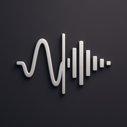

<div align="center">



# MacVoxCPM

**A native macOS app for [VoxCPM](https://github.com/OpenBMB/VoxCPM) — tokenizer‑free, multilingual, studio‑quality text‑to‑speech.**

Type some text, press Generate, hear a voice. No terminal, no Python setup, no Conda.

</div>

---

MacVoxCPM is a SwiftUI app that wraps OpenBMB's official `voxcpm` package. On first
launch it quietly sets up its own Python runtime and downloads the **VoxCPM2** model
(2B parameters, 30 languages, 48 kHz) from Hugging Face — then everything runs
locally on your Mac. Nothing is sent to a server; generation happens on‑device
(Apple Silicon / MPS).

## ✨ Features

- 🗣️ **Text‑to‑Speech** in 30 languages, 48 kHz output.
- 🎨 **Voice Design** — describe a voice in plain language (e.g. *"a young woman, gentle and warm"*) and the model invents it.
- 🎛️ **Voice Cloning** — drop in a short reference clip and clone its timbre.
- 🎙️ **Ultimate Cloning** — reference clip + transcript for maximum fidelity.
- 📚 **Voice library** — save reference clips (with optional transcripts) and reuse them across generations.
- 🕓 **History** — every generation is kept with its settings; replay or reload any of them.
- 🎚️ **Advanced Settings** tucked behind one button — CFG, inference timesteps, seed lock, output format, loudness normalize, device — so the main window stays simple.
- 🌊 **Waveform playback** with scrubbing, plus Save‑As / Reveal‑in‑Finder / drag‑out.
- 💾 **Self‑contained** — the `.app` is tiny (~33 MB); the heavy runtime and model live in Application Support and can be wiped or re‑downloaded from Settings.

## 📦 Install

1. Download `MacVoxCPM-x.y.z.dmg` from the [Releases](../../releases) page.
2. Open the DMG and drag **MacVoxCPM** to **Applications**.
3. First launch: because the app isn't notarized, right‑click → **Open** (or run
   `xattr -dr com.apple.quarantine /Applications/MacVoxCPM.app`).
4. The onboarding screen will set up the runtime and download the model. **This is
   a one‑time ~5–15 minute process** depending on your connection. Subsequent
   launches start in a second or two.

### Requirements

| | |
|---|---|
| **macOS** | 15 Sequoia or newer |
| **Chip** | Apple Silicon strongly recommended (uses PyTorch MPS); Intel falls back to CPU |
| **Disk** | ~8 GB free on first launch (≈2.5 GB Python runtime + ≈5 GB model weights) |
| **Network** | Needed once, on first launch, to download the runtime and model |

## 🚀 First run, step by step

The onboarding window shows live progress for each phase:

1. **Set up Python runtime** — a bundled [`uv`](https://github.com/astral-sh/uv) binary creates an isolated Python 3.11 environment.
2. **Install VoxCPM** — `voxcpm`, PyTorch, and friends are installed into that environment (the slow step).
3. **Start inference server** — a small local FastAPI server is launched.
4. **Download model** — `openbmb/VoxCPM2` (~5 GB) streams from Hugging Face, with a live byte counter.
5. **Load model** — weights are loaded into memory (MPS) and a warm‑up pass runs.

Everything is stored under `~/Library/Application Support/MacVoxCPM/`
(`runtime/`, `models/`, `voices/`, `outputs/`). You can inspect or clear each from
**Settings → Storage**.

> 💡 If you already have a Hugging Face token at `~/.cache/huggingface/token`, the app
> reuses it for faster, non‑rate‑limited downloads. None is required.

## 🛠️ Build from source

```bash
git clone https://github.com/moerdowo/MacVoxCPM.git
cd MacVoxCPM

./scripts/fetch-uv.sh        # download the pinned uv binary + stage the sidecar
./scripts/build-app.sh       # → build/stage/MacVoxCPM.app
# or, to produce a distributable disk image:
./scripts/build-dmg.sh 0.1.0 # → build/MacVoxCPM-0.1.0.dmg
```

For day‑to‑day development:

```bash
./scripts/fetch-uv.sh        # once
swift run MacVoxCPM
```

> The `uv` binary and the Python sidecar sources are fetched at build time
> (`scripts/fetch-uv.sh`) and are **not** committed to the repo, which keeps it small.
> Run that script once before your first build.

## 🧱 How it works

```
┌─────────────────────────────────────────────┐
│  MacVoxCPM.app  (SwiftUI, native)            │
│   text · voice mode · waveform · settings    │
└───────────────┬─────────────────────────────┘
                │  HTTP on 127.0.0.1 (random port)
                ▼
┌─────────────────────────────────────────────┐
│  Python sidecar (FastAPI + uvicorn)          │
│   voxcpm.VoxCPM.from_pretrained(...)          │
│   /health · /status · /generate · /shutdown   │
└───────────────┬─────────────────────────────┘
                ▼
   ~/Library/Application Support/MacVoxCPM/
     runtime/  uv + Python 3.11 venv (voxcpm, torch, …)
     models/   Hugging Face cache (VoxCPM2 weights)
     voices/   your saved reference clips
     outputs/  generated audio
```

The Swift app never imports Python. It manages a child process (the sidecar),
scrapes its stdout to learn the chosen port and download progress, and talks to it
over localhost. Generation parameters map 1:1 to `voxcpm`'s `generate()` arguments.

| Concept | `voxcpm` argument |
|---|---|
| Voice Design `(...)` prefix | `text="(description)…"` |
| Reference audio | `reference_wav_path` |
| Ultimate clone prompt + transcript | `prompt_wav_path`, `prompt_text` |
| CFG value | `cfg_value` |
| Inference timesteps | `inference_timesteps` |

## 🩹 Troubleshooting

- **Stuck on "Installing VoxCPM…"** — that step downloads PyTorch (~2 GB); give it a few minutes. Open **Show Log** in the onboarding screen to watch progress.
- **Setup failed** — the failure view shows the full error and a **Retry** button. The full log lives at `~/Library/Application Support/MacVoxCPM/runtime/sidecar.log`.
- **Want to start clean** — **Settings → Storage** lets you re‑download the model or uninstall the Python runtime (the app quits; relaunch to rebuild).
- **Out of memory on long text** — try shorter passages, or switch **Device** to CPU in Advanced Settings.

## ⚠️ Responsible use

VoxCPM can produce highly realistic synthetic speech. Do not use it to impersonate
real people, commit fraud, or spread disinformation. Clearly label AI‑generated audio.

## 📄 License

MacVoxCPM (the app shell) is released under the [MIT License](LICENSE).
It is a front‑end for [VoxCPM](https://github.com/OpenBMB/VoxCPM) by OpenBMB, whose
model weights and `voxcpm` package are licensed under **Apache‑2.0** and downloaded
at runtime.

## 🙏 Credits

- [OpenBMB / VoxCPM](https://github.com/OpenBMB/VoxCPM) — the model and Python package that does all the heavy lifting.
- [astral‑sh / uv](https://github.com/astral-sh/uv) — fast, self‑contained Python environment management.
